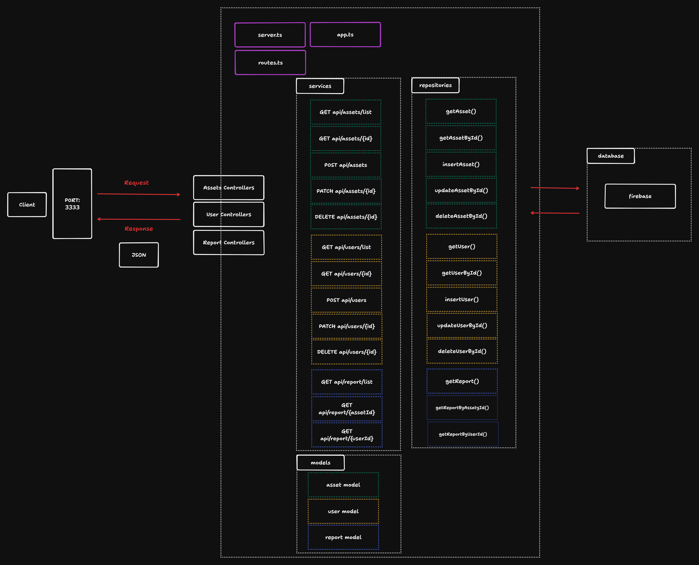

# App Plan

## Description:
A web app / PWA to manage assets, such as tablets, stands, and printers used in events.

## Features:
- Check-in of equipment using ID or QR code when the technician receives the item.
- User access control:
    - Technicians can only perform check-ins.
    - Admins can manage reports, users, and assets (CRUD operations).
- Reports:
    - Track which user has the asset.
    - Count how many events an asset participated in.
- Event calendar vs. reserved assets.

## Architecture:

